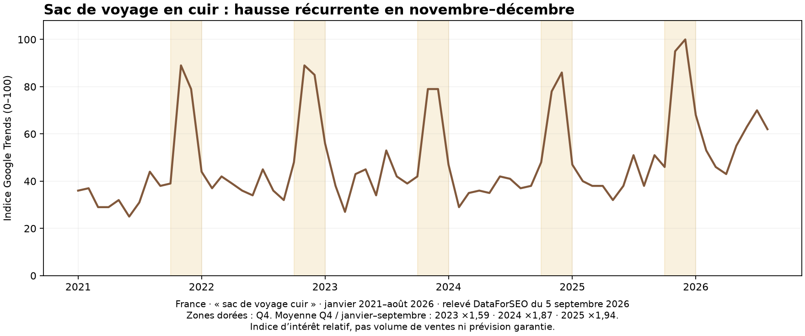

# Cinquième avis : sac de week-end en cuir vintage — France

**AVIS GO RETIRÉ après correction utilisateur : ce sac est sous le seuil requis de 15 000 recherches pertinentes mensuelles. Le texte suivant documente l’avis antérieur, devenu caduc.** Il s'agit d'un avis favorable à un petit test après contrôle d'un échantillon, pas d'une rentabilité démontrée. Le modèle retenu est le sac de voyage S.worker 42 × 24 × 22 cm, café foncé. Les autres sacs, la chapka et le pyjama ne constituent pas des GO supplémentaires.

## Pourquoi ce produit répond au besoin

Le cuir patiné, les surpiqûres et les poches extérieures donnent une présentation adaptée à un cadeau utile pour un homme qui part en court séjour. C'est une hypothèse de valeur perçue, soutenue par les offres concurrentes observées, à confirmer en recevant le produit. Le format compact évite le choix d'une taille de vêtement. L'emballage cadeau n'est pas déclaré inclus.

La demande possède un surcroît Q4 récurrent et mesuré. Une source exacte déclare du stock et une livraison en 7–12 jours vers la France. Ce délai convient à une offre préparée en amont de Noël ; il ne permet pas de promettre une livraison de dernière minute. L'estimation API n'est pas une livraison réalisée.

## Courbe Q4 vérifiée

Relevé DataForSEO Google Trends du 05/09/2026, France, recherche Web, janvier 2021–août 2026, expression **sac de voyage cuir**. Les 36 mois des trois années comparées ci-dessous sont renseignés ; aucune valeur nulle remplacée par zéro. [Ouvrir Google Trends](https://trends.google.com/trends/explore?hl=fr&geo=FR&date=2021-01-01%202026-08-31&q=sac%20de%20voyage%20cuir).

| Année | Sept. | Oct. | Nov. | Déc. | Moyenne Q4 / moyenne janvier–septembre |
|---|---:|---:|---:|---:|---:|
| 2023 | 39 | 42 | 79 | 79 | 1,59 |
| 2024 | 38 | 48 | 78 | 86 | 1,87 |
| 2025 | 51 | 46 | 95 | 100 | 1,94 |

Le renforcement se concentre surtout en novembre et décembre. La courbe valide une saisonnalité de la **famille des sacs de voyage en cuir**, sans isoler ce modèle, sans prouver que toutes les recherches correspondent à des cadeaux et sans garantir Q4 2026. Les nombres sont des indices d'intérêt normalisés, pas des ventes ni des volumes mensuels.

## Mots-clés à tester

Keyword Planner via DataForSEO, France, français. Volumes moyens mensuels ; CPC historiques en **USD**, pas promesses de CPC Google Ads en euros. Les variantes proches ne sont pas additionnées.

| Expression | Volume | CPC USD | Usage |
|---|---:|---:|---|
| sac de voyage cuir | 1 900 | 0,85 | Taille de la famille ; marché général fortement marqué par les enseignes |
| sac voyage cuir homme | 1 600 | 1,10 | Même réserve ; ne pas attribuer tout le volume à l'angle vintage |
| sac weekend cuir homme | 320 | 1,01 | Groupe week-end, à contrôler en termes de recherche |
| sac week end cuir | 110 | 0,75 | Variante proche, sans addition automatique |
| sac de voyage cuir vintage | 90 | 0,58 | Priorité pour le premier groupe |
| sac de voyage homme cuir vintage | 90 | 0,74 | Variante proche, sans addition automatique |
| sac voyage cuir vintage | 40 | 0,68 | Variante proche, sans addition automatique |

Les requêtes « petit sac de voyage cuir », « sac de voyage cuir 40 cm » et « sac de voyage cuir achat » n'ont pas de volume renseigné dans ce lot. Cela ne vaut pas zéro demande. L'angle précis peut fournir peu de clics par semaine ; lancer un test chaque semaine ne garantit pas une conclusion fiable chaque semaine.

## Source exacte par l'API AliExpress installée

[Produit 4000755945602](https://www.aliexpress.com/item/4000755945602.html), **S.worker Official Store**, ID boutique 5604399. Pays de départ CN ; destination FR, une unité.

| Champ | Observation du 05/09/2026 |
|---|---|
| Variante | Dark coffee / China Mainland |
| SKU | **10000007329849939** |
| Prix de la variante | **95,99 €**, taxes incluses selon le champ API |
| Transport | **1,99 €**, AliExpress Selection Standard, suivi |
| Total déclaré | **97,98 €** |
| Stock de la variante | **25**, cohérent entre détail et fret |
| Délai estimé | **7–12 jours**, dates renvoyées 12–17 septembre |
| Dimensions décrites | **42 × 24 × 22 cm**, avec tolérance manuelle annoncée |
| Poids décrit | **1,3 kg**, tolérance annoncée |
| Matière | Cuir bovin véritable ; description pleine fleur / Crazy Horse, déclaration fournisseur non testée |
| Historique API | 9 ventes, 0 évaluation renvoyée ; qualité non établie |

Le visuel de la variante café foncé montre un vrai sac polochon à poche frontale zippée, poches latérales, deux anses et fixation de bandoulière. [Visuel exact fournisseur](https://ae01.alicdn.com/kf/H83ab21f2959a47b1a48673f24a1a65a3A.jpg). Le contenu du colis et la bandoulière doivent être vérifiés sur l'échantillon. Les dimensions de 42 cm ne valent pas une autorisation universelle de bagage cabine.

Le détail général renvoie aussi `delivery_time: 3`. **Ce nombre n'est pas retenu comme délai client** : le devis de fret pour la variante et FR indique 7–12 jours. Le champ `guaranteed_delivery_days: 60` est distinct de cette estimation courte ; aucune garantie de réception sous douze jours n'est affirmée. Le seuil de livraison gratuite n'est pas appliqué arbitrairement : le devis conserve 1,99 €.

## Concurrence : Search d'abord, prix réellement comparés

Deux relevés Google natifs, `sac voyage cuir homme` et `sac voyage cuir vintage`, France, français, personnalisation désactivée par paramètre, le 05/09/2026 : **Mes Bagages observé en annonce textuelle Search sur les deux requêtes**. Un seul domaine unique identifié dans ces deux relevés. Les blocs « Produits sponsorisés » sont du Shopping et ont été séparés.

La requête générale montre notamment Arthur & Aston, Le Tanneur et Paul Marius en organique, ainsi que de nombreuses marques dans les modules produits. Elle n'est pas retenue comme point d'entrée du premier test. Sur « vintage », les résultats organiques comprennent Bagaran, OH MY BAG, EziClic, Fantini Pelletteria, Le Globe-Trotteur, Voyage Paisible et Skin Project, avec aussi Paul Marius et Leboncoin. Ce relevé laisse une place visible aux spécialistes ; il ne prouve pas une faible pression d'enchères au Q4.

| Offre concurrente observée | Prix public | Comparabilité et limites |
|---|---:|---|
| [La Casa du Cuir — Maxime](https://lacasaducuir.com/products/sac-voyage-homme-cuir-maxime) | **184,99 €**, deux variantes disponibles dans le JSON public | Cuir bovin déclaré, 45 × 17 × 28 cm, 1,5 kg. Format compact voisin, design différent : pas de grande poche frontale comme la source. Shopify confirmé. |
| [La Casa du Cuir — Léandre](https://lacasaducuir.com/products/products-sac-de-sport-cuir-homme-leandre-multi-poches) | **209,99 €**, noir/café disponibles dans le JSON public | Cuir et multi-poches, 46 × 25 × 25 cm, 1,9 kg : comparable par usage, plus grand/lourd, pas identité du modèle. Shopify confirmé. |
| [La Casa du Cuir — Lenny](https://lacasaducuir.com/products/sac-voyage-homme-cuir-lenny) | **199,99 € noir ; 209,99 € autres coloris**, disponibles | Cuir Crazy Horse, 50 × 23 × 26 cm, chaussures séparées. Plus grand et autre organisation ; ne pas prétendre reproduire cet avantage. |
| [La Sacoche Parisienne — Marco Polo](https://www.la-sacoche-parisienne.com/products/sac-de-voyage-homme-cuir-vintage) | **225,90 €**, trois coloris disponibles dans le JSON public | 50 × 30 × 24 cm, cuir déclaré : plus grand que la source. Shopify confirmé. |
| [Valmont — Weekender Café](https://valmontofficiel.com/products/sac-weekender-valmont-cuir-pleine-fleur-cafe) | **219,99 €**, disponible dans le JSON public | 52 × 25 × 28 cm, cuir bovin déclaré. Plus grand, autre modèle. Shopify confirmé. |

Ces prix attestent d'offres affichées, pas de ventes ou de marges constatées. Le prix de test **189,90 €** est une hypothèse située près du Maxime compact et sous plusieurs modèles plus grands ; le haut de la fourchette ne justifie pas de demander 250 € pour ce petit sac.

Contre-offres à ne pas masquer : Shopping affiche SID & VAIN autour de **139,90–159,90 €**, Gusti Ruben 36 L **139,95 €** et Gusti Oliver **79,95 €** ; des produits Amazon apparaissent autour de **102–129,99 €**. Les variantes, matières, dimensions et disponibilités de toutes ces contre-offres n'ont pas été auditées. Skin Project affiche un sac chèvre 59 × 31 × 25 cm à **160 €**, autre cuir et autre fabrication déclarée. La concurrence au prix est réelle ; aucun avantage de prix absolu n'est revendiqué. Les sacs PU bon marché et les sacs de luxe de marque ne sont pas assimilés au même modèle.

**TrendTrack** : sur dix enregistrements retournés pour La Casa du Cuir, dix correspondent au domaine et au réseau Search, avec des dernières observations allant de mai au **25 août 2026**. Pour La Sacoche Parisienne, seulement sept des dix résultats correspondent exactement, dernières observations **16–17 mai 2026** ; les trois autres sont exclus. Les totaux de recherche floue ne sont pas des comptes d'annonces du concurrent. Le statut API « active » ne prouve pas une diffusion aujourd'hui. Ces données prouvent une présence historique Search de boutiques de la catégorie, pas une campagne spécifique rentable sur le sac retenu.

## Économie et test proposé

Hypothèses prudentes, en euros : **189,90 / 1,20 − 97,98 − 5 − 15 = 40,27 €** disponibles avant publicité. Les 5 € couvrent une estimation paiement/exploitation variable ; les 15 € sont une réserve pour retours, défauts et écarts, pas des coûts déjà mesurés. Aucun crédit de TVA fournisseur supposé. Les coûts fixes, l'échantillon et d'éventuels frais non couverts par le devis restent à financer.

- **Prix de test : 189,90 € TTC**, livraison incluse. À 179,90 €, la contribution estimée descend à **31,94 €** ; ne pas baisser le prix sans recalculer le CPA cible.
- **CPA cible initial : 20–23 €**, plafond théorique de contribution **40,27 €** ; ce plafond n'est pas une cible de rentabilité.
- **Budget publicitaire maximal proposé : 100 €**, campagne Search France, un produit et une variante. Aucun lancement effectué.
- Groupes distincts « cuir vintage » et « week-end cuir », correspondances exacte/expression, annonces qui présentent réellement le format compact et la matière vérifiée. Exclure les recherches de marques, d'occasion, réparation, patron, fabrication et PU non pertinentes.
- Contrôle des termes et du suivi de commande à J3, bilan à J7, puis J14–J21 si le volume est insuffisant, toujours dans le plafond initial. Ne pas élargir au marché général uniquement pour dépenser le budget.
- À 100 € dépensés sans vente après prise en compte du délai de conversion, pause du test et diagnostic. Des ventes sous CPA cible justifient une poursuite prudente ; une ou deux commandes seules ne démontrent pas une rentabilité durable. Entre cible et plafond, travailler offre/requêtes avant toute hausse de budget.

Avant la mise en vente : recevoir un échantillon pour confirmer dimensions, cuir, odeur, coutures, fermeture, bandoulière et présentation ; mesurer le délai réel et recontrôler l'offre de la variante. Ces contrôles préparent le test et ne sont pas présentés comme réalisés. Les prix promotionnels de l’horloge, du téléphone audio et de la robe doivent aussi être revérifiés avant leurs propres tests.

La préparation peut commencer en septembre, avec un premier test en octobre pour arriver informé en novembre. Pour une promesse de réception avant Noël, fixer la dernière date de commande seulement après mesure du délai complet et ajout d'une marge ; ne pas transformer le devis de septembre en garantie pour décembre. Une demande dans un autre pays européen impose son propre devis et sa propre concurrence.

## Pistes non retenues et pièges documentés

- **Chapka cuir/lapin rex** : `chapka homme` 5 400/mois, CPC 0,20 USD ; hausse novembre–décembre visible malgré des lacunes estivales. La tête `chapka` 40 500 est contaminée par la marque d'assurance voyage et n'est pas employée. Source 1005004492499984, noir 57–59, SKU 12000029347746783, 33,59 € rendu, 516 unités, **8–15 j**. Les tailles voisines 55–57 et 59–61 sont à **9–21 j**, pas au même délai. Autre source rex 38,99 + 1,20 € : 9–24 j. Cuirs Guignard affiche un agneau/lapin à 89 € ; les boutiques Shopify à 39,90–59,90 € présentent des matières différentes ou contradictoires. Pas de cinquième GO sur cette piste.
- **Pyjama en soie** : Q4 fort et complet, ratios 2,67 / 2,52 / 2,67 sur 2023–2025. Source femme 1005007958303434, blanc M, 75,39 € rendu standard 8–15 j, ou 115,30 € Premium 7–11 j ; matière seulement déclarée et comparaison Search non terminée. Source homme 1005009856232512 : tailles partiellement épuisées, prix du haut+pantalon 125,39 € distinct du minimum de recherche. Aucun GO.
- **Sac S.worker 7411 à 45,79 €** : 50 unités, rendu Premium 91,27 € /7–11 j. Mais l'illustration technique indique **43 × 32 × 4 cm**. Le titre « week-end » ne suffit pas : référence écartée, aucune capacité de sac polochon inventée.
- Autres sacs : ANGENGRUI 80,39 € rendu **8–15 j** ; FANCODI M111 L 115,11 € standard **8–15 j**, ou 161,92 € Premium **7–11 j** ; M112 noir 217,02 € par UPS **3–13 j**. Ces alternatives ne remplacent pas le devis exact du 42 cm retenu.

## Audit des cinq avis et traçabilité

Les quatre premiers restent l'horloge flip noyer, le livre d'or audio, le voile de mariée et la robe de shooting grossesse. Le nouveau sac forme une cinquième famille distincte : ni variante de l'un des quatre, ni sac à compression sous vide déjà présent dans le registre. L'ancienne famille « cuir & maroquinerie » du registre Codex concerne l'outillage, pas ce sac fini.

Registres GitHub central et Codex recontrôlés après `git fetch origin main`, sans modification par rapport au témoin 6450259be5ff1b1a96b3cc7a2b754d2d67f1e14d. Les sources des quatre avis antérieurs ont été relues : SKU, prix promotionnel, stock et devis de fret correspondent aux montants de la synthèse. France uniquement pour les cinq.

707 lignes Keyword Planner au total, comprenant variantes et contrôles, pas 707 produits uniques. Coût DataForSEO cumulé observé : **3,74400 USD**. Ce complément ajoute 25 lignes et quatre courbes brutes, dont la courbe `chapka` exclue pour ambiguïté de marque.

Preuves : `ae-gifts-details.jsonl`, `ae-gifts-shipping.jsonl`, `trends-q4-sac-voyage-cuir.json`, `volumes-sac-voyage-vintage-fr.json`, `volumes-q4-chapka-cuir-soie-fr.json`, fichiers publics `*-live.json`, `tt-casaducuir-search.json`, `tt-sacoche-search.json`, `observations-search-cuir-q4.json`. Les visuels distants ont été inspectés dans le navigateur. Aucun skill, mémoire ou autre discussion consulté pour cette analyse.
