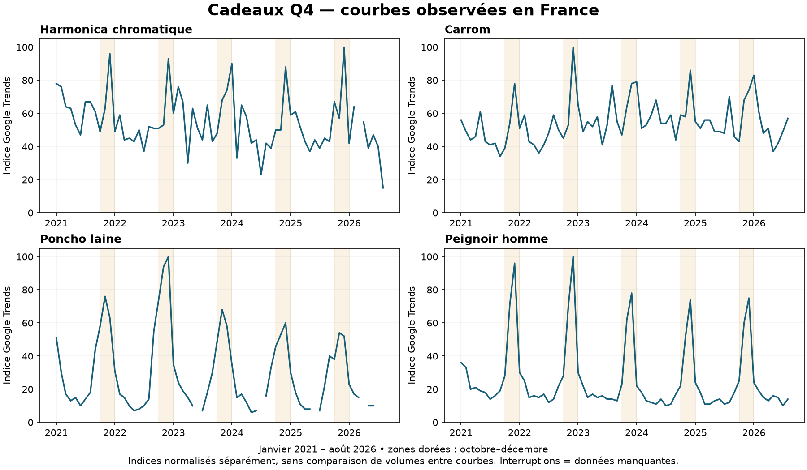

# Cinquième produit Q4 — loisirs et textile

Relevés du 5 septembre 2026, France. **4/5 GO_TEST_LIMITE : aucun cinquième ajouté.** L'objectif reste ouvert. Les quatre recommandations antérieures ne changent pas.

Le filtre demandé est appliqué : cadeau à 80–500 €, valeur perçue, livraison assez courte, hausse Q4 observée dans Google Trends, concurrence Google Search et comparaison exacte des produits. Le délai inférieur à dix jours était une cible de recherche proposée, pas une limite imposée par Hakim. Une estimation API n'est pas une livraison constatée.

## Ce que les nouvelles courbes établissent

[Graphique PDF](courbes-q4-loisirs.pdf) · [Données mensuelles](courbes-trends-q4-loisirs.csv). Source : Google Trends via DataForSEO, recherche Web France, janvier 2021–août 2026, une requête par courbe. Chaque série est normalisée séparément ; on ne compare pas leurs indices comme des volumes. Les mois manquants ne sont pas remplacés par zéro.

| Expression | Volume mensuel FR / CPC USD | Q4 / janvier–septembre 2023 ; 2024 ; 2025 | Conclusion |
|---|---|---|---|
| Harmonica chromatique | 1 300 / 0,38, mesure antérieure | 1,14 ; 1,29 ; 1,59 | Hausse Q4 récurrente, plus forte en 2025. Source rapide compétitive non trouvée. |
| Carrom | 3 600 / 0,30 | 1,12 ; 1,17 ; 1,16 | Regain modéré, décembre élevé ; règles et découverte du jeu incluses dans la tête. |
| Poncho laine | 720 / 0,37 | Non calculé : un mois d'été manquant chaque année | Octobre–décembre nettement élevés. Le signal saisonnier existe malgré les lacunes ; demande tricot à exclure des annonces. |
| Peignoir homme | 22 200 / 1,26 | 3,14 ; 3,47 ; 3,64 | Très fort signal cadeau Q4. Volume mesuré seulement, aucune source mid-ticket qualifiée. |
| Tambour chamanique | 2 900 / 0,41, mesure antérieure | 0,98 ; 1,01 ; 0,88 | Ne valide pas une hausse Q4. |
| Hanten | 480 / 0,42 | Incalculable | 5, 10 et 5 mois manquants ; l'hiver semble favorable, mais preuve insuffisante. |
| Crokinole | 1 300 / 0,21 | Incalculable | 3, 6 et 5 mois manquants. Recherche API AliExpress vide. |
| Châle cachemire | Non mesuré dans cette passe | Incalculable | 8, 12 et 11 mois manquants. Ne pas substituer le volume d'étole cachemire. |

Le ratio compare deux moyennes mensuelles, pas trois mois à neuf mois de volumes bruts. Les volumes Keyword Planner portent sur la moyenne renvoyée, pas sur décembre seul. Les 18 nouvelles expressions sont dans le CSV général ; elles ne représentent pas 18 produits validés.

## Poncho laine : meilleure preuve logistique, concurrence défavorable

Source officielle API : [1005007387359126](https://www.aliexpress.com/item/1005007387359126.html), modèle 24L99902, marque déclarée lilijasmi. Variante beige clair SKU **12000040536649202**, **25,79 €**, **197 unités déclarées**. La fiche décrit 100 % laine dans les attributs, environ 60 cm de longueur au milieu et 140 cm de tour de poitrine. Le prix comprend le poncho seul ; les accessoires photographiés sont exclus. Composition, douceur et rendu restent déclaratifs, à contrôler sur échantillon.

Transport France pour une unité : gratuit **8–15 jours**, ou Premium **2,29 € / 7–11 jours**, soit **28,08 € rendu** avec cette seconde option. C'est une piste logistique exploitable, pas encore un avis de test.

Observation Google natif `poncho laine femme`, FR, 05/09 : **aucune annonce textuelle Search identifiée**. Le bloc explicitement « Produits sponsorisés » contient Telar à 99 €, Label Naturel et Just Cashmere ; il s'agit de Shopping. En résultats Web, Eric Bompard, Caroll et La Redoute sont visibles, avec plusieurs spécialistes. Les blocs produits affichent également Galeries Lafayette et Monoprix ; ils ne sont pas comptés comme annonces Search.

Comparaison des prix, sans supposer l'identité des modèles :

- [Le Pull Irlandais — Aran Crafts mérinos](https://www.lepullirlandais.com/pulls-et-ponchos-femme-en-laine-merinos-poncho-premier-prix,21-854.htm) : résultat natif 76,90 € + 6,95 € de livraison. Autre marque et autre confection.
- [La Carde — poncho laine](https://www.boutique.lacarde-pyrenees.com/poncho/25-poncho) : résultat natif 99 €, annoncé en stock, port 15 €. Origine et tissage distincts de la source chinoise.
- [Mon Poncho — collection](https://mon-poncho.fr/collections/poncho-femme) : présence de ressources Shopify ; modèles laine affichés autour de 59,99–69,99 €, autres coupes plus chères. La technologie ne prouve pas le dropshipping.
- [Telar — col roulé](https://telar.fr/products/poncho-en-laine-femme-col-roule-gris) : 99 € dans le bloc sponsorisé. Page directe non obtenue ; ni composition ni disponibilité confirmées.

À titre de sensibilité, 89,90 / 1,20 − 28,08 − 3 de paiement − 12 de provision retours = **31,84 € avant publicité**, sous ces hypothèses. Ce calcul n'efface pas les enseignes connues et les alternatives moins chères. **Dépriorisé pour ce cinquième selon le filtre concurrentiel demandé.** Ne pas le transformer en GO à cause de sa seule marge théorique.

## Hanten : deux sources détaillées, délais trop longs

- 1005010764300711, SKU 12000056113945202 : 50,99 + 1,76 = **52,75 €**, stock 429, **24–38 jours**.
- 1005012025500758, SKU 12000057309875720 : 40,59 + 1,76 = **42,35 €**, stock 9 999 déclaré, **25–38 jours**.

Aucune option rapide retournée pour ces variantes. Ces deux offres ne répondent pas à la demande actuelle, indépendamment de l'attrait visuel du vêtement. Courbe trop lacunaire en plus.

## Carrom : le transport et les vrais comparables changent l'avis

1005008629979753, SKU 12000046024002593 : **60×60×4 cm**, 3,4 kg déclaré, 21,79 €, stock 9 989. Ce n'est pas le plateau de 70 ou 77 cm d'un spécialiste. La liste exacte des pions/accessoires n'est pas établie.

Rendu FR : **76,68 € en 11–39 j**, **78,91 € en 9–24 j**, ou Fedex **98,77 € en 3–12 j**. Ce prix rapide ne laisse pas une offre convaincante face à :

- [L'Univers du Baby Foot — Mango 66 cm](https://www.luniversdubabyfoot.fr/jeux-bois/carrom-ou-billard-indien/5869-carrom-de-loisirs-mango-66-66.html) : **79 €**, annoncé en stock, délai huit jours, 66×66 cm, surface 60 cm, 6 kg, accessoires annoncés. Port non vérifié.
- [Carrom Online — Mango 66 cm](https://www.carrom-online.com/article-carrom-mango-66-cm-327.htm) : **69,99 €**, mais « bientôt disponible ». Ce n'est pas une offre actuellement livrable confirmée.

**Source non retenue.** Le prix supérieur d'un Ellora de plus grande taille n'est pas le bon ancrage pour vendre ce petit plateau.

## Harmonica : saisonnalité favorable, offre non retenue

1005008670215807 : le prix d'appel 46,39 € correspond au **12 trous**. Le **16 trous argenté**, SKU 12000046170701944, coûte **56,39 €**, stock 66. Livraison gratuite **9–24 jours** ; Fedex 4–16 j ajoute 56,64 €, soit **113,03 € rendu**. UPS 3–23 j ne constitue pas une promesse rapide fiable. Deux autres fiches ont été détaillées, dont une avec contradiction « 16 trous / 48 tons ».

Google natif `harmonica chromatique 16 trous` : aucune annonce textuelle identifiée à cet instant ; Amazon, Woodbrass et plusieurs spécialistes de marques sont présents en résultats Web. Les instruments Hohner/Suzuki à 200–400 € ne sont pas des comparables de qualité prouvée pour ce générique.

[Grandado — Qimei 16 trous](https://fra.grandado.com/products/qimei-harmonica-chromatique-16-trous-64-tons-bouche-orgue-instrumentos-cle-c-harpe-chromatique-instruments-de-musique?variant=UHJvZHVjdFZhcmlhbnQ6NzM0MDI0NjYw) affiche 119,59 € dans le relevé Web. Ce prix seul ne valide ni la demande à ce tarif, ni l'identité du SKU. Les offres moins chères des marketplaces restent des contre-signaux. **Aucun GO pour cette source.**

## Kalimba : recherche de stock supplémentaire

La courbe Q4 et la baisse de fond restent celles du [premier complément](COMPLEMENT-Q4.md). Les nouvelles recherches API distinguent instruments, lamelles seules et variantes :

- 1005009254769709 : River 37,19 € / stock 1 ; Whale 38,99 € / stock 1 ; Mountain stock 0. Ne résout pas le besoin de disponibilité.
- Hluru 1005007630785190 : 34 C à 63,69 € / stock 3 ; 34 B stock 2. Le 38 touches à 77,99 € n'est pas la même variante.
- 1005008596268871, GIOIO, caisse 34 notes noyer, SKU 12000045884509752 : **68,39 € / stock 45**. Livraison gratuite **9–24 jours**, ou Fedex **136,74 € rendu en 3–12 jours**. Acajou 66,39 € / stock 40, fret non mesuré pour ce SKU.
- 1005006295331154, variante 34 C plate SKU 12000036647179878 : **78,39 € / stock 12**, gratuit **11–28 jours**, aucune option rapide retournée. Attribut de marque OEMG alors que modèle/titre mentionnent Chill Angels : ne pas affirmer une authenticité vérifiée.

[Instruments Zen — kalimbas](https://instruments-zen.fr/collections/kalimbas) affiche une caisse 34 lames à 149,99 €, avec code ZEN10 en bannière dont l'applicabilité n'a pas été testée. [Instruments du Monde — 34 lames](https://instruments-du-monde.com/products/kalimba-34-lames) affiche 159 €, annoncé disponible, mais modèle plat et composition contradictoire érable/acacia sur la page. Ces références ne justifient pas de vendre la caisse GIOIO au même prix en ignorant 136,74 € de coût express. **Pas de cinquième sur ces offres.**

## Traçabilité et suite

21 fichiers bruts ajoutés, huit courbes supplémentaires et 18 lignes Keyword Planner. Coût DataForSEO de cette passe : **0,178 USD** ; cumul observé **3,520 USD**, **682 lignes** dans le CSV général, sans additionner les volumes des synonymes. Aucune nouvelle requête TrendTrack dans cette passe. Aucun achat, annonce lancée ou message envoyé à un fournisseur.

Les deux registres de `origin/main` ont été recontrôlés : pas de différence avec le témoin 6450259be5ff1b1a96b3cc7a2b754d2d67f1e14d. Les familles déjà réservées dans cette même recherche restent une seule famille ; ajouter une couleur ou un nombre de touches ne produit pas un nouveau GO.

La recherche doit encore trouver une offre qui réunit les quatre preuves : hausse Q4, cadeau mid-ticket crédible, concurrence acceptable et source rapide. Les délais, prix ou stocks ci-dessus ne sont pas des autorisations de lancement.
