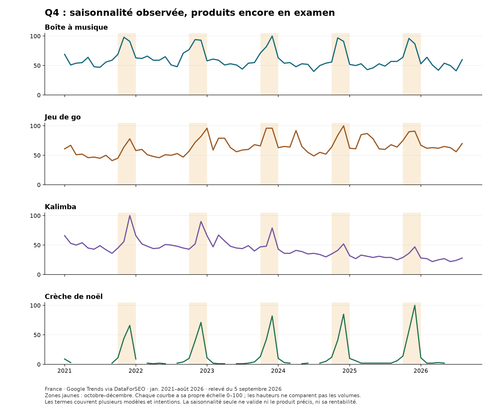

# Cinquième produit : examen Q4 du 5 septembre 2026

**Statut : 4/5 GO TEST LIMITÉ. Aucun cinquième produit validé dans cette passe.** Les quatre avis précédents sont conservés. L'exigence nouvelle concerne le cinquième : cadeau, valeur perçue élevée, livraison assez courte et courbe Trends favorable au Q4. Le repère de livraison idéalement sous dix jours est une cible proposée par l'agent, pas un seuil imposé par Hakim.

## Courbes réellement obtenues

[PDF](courbes-q4.pdf) · [Données mensuelles](courbes-trends-q4.csv) · [Calculs annuels](saisonnalite-q4.csv)

Google Trends via l'API officielle DataForSEO, France, recherche Web, janvier 2021–août 2026, huit requêtes séparées. Les indices de deux courbes ne mesurent pas leurs volumes relatifs. Les cellules nulles restent manquantes et ne sont pas remplacées par zéro. Le ratio compare la moyenne octobre–décembre à janvier–septembre ; il est calculé uniquement lorsque les douze mois sont disponibles. Aucune observation du Q4 2026, encore futur.

| Terme | Q4 / janvier–septembre en 2023 | 2024 | 2025 | Interprétation |
|---|---:|---:|---:|---|
| boîte à musique | 1,56× | 1,56× | 1,61× | Signal récurrent sur cinq ans, mais famille comprenant beaucoup de petits articles sous 80 € |
| jeu de go | 1,25× | 1,33× | 1,23× | Regain réel chaque année, intentions achat/apprentissage/jeu en ligne mélangées |
| kalimba | 1,13× | 1,16× | 1,26× | Décembre est le pic annuel sur les cinq années ; intérêt global en recul, décembre 2021 = 100 contre 47 en 2025 |

`goban` donne un signal plus directement matériel, avec décembre 2024 à 61 et décembre 2025 à 100, mais trop de mois nuls pour établir une série annuelle complète. `acheter mahjong`, `coffret calligraphie` et `carrousel musical` sont trop lacunaires pour une validation autonome. `crèche de noël` présente une saisonnalité Q4 nette ; cela ne prouve pas qu'une petite crèche générique puisse être vendue à 80–500 €.

Sources consultables : [Trends boîte à musique](https://trends.google.com/trends/explore?geo=FR&date=2021-01-01%202026-08-31&q=bo%C3%AEte%20%C3%A0%20musique), [Trends jeu de go](https://trends.google.com/trends/explore?geo=FR&date=2021-01-01%202026-08-31&q=jeu%20de%20go), [Trends kalimba](https://trends.google.com/trends/explore?geo=FR&date=2021-01-01%202026-08-31&q=kalimba). Les résultats exacts de cette passe sont archivés dans `preuves/trends-q4-*.json`.

## Offres, variantes et livraison

**Jeu de go.** Keyword Planner : tête 14 800/mois, goban 480, acheter jeu de go 70, bois 140, traditionnel 110. Ces valeurs ne sont pas additionnées. [Variantes](https://www.variantes.com/ensemble-jeu-de-go-boutique/5870-ensemble-de-go-chinois.html) propose un ensemble bambou/Yunzi/bols imitation osier à 85,90 € ; [son ensemble bois et bols jujube](https://www.variantes.com/ensemble-jeu-de-go-boutique/5587-ensemble-go-standard-complet.html) est à 101 €. Le modèle AliExpress 1005007279368352 à 32,59 € avant fret est un tapis souple 44×47 cm avec bols : image inspectée, pas un goban bois. Le 1005012925231284 affiche 400,69 € pour le plateau seul, plus de 500 € avec pierres/bols : le prix d'appel ne concerne pas le set complet. La fiche 1005012933768992 découverte par index Web n'a pas fourni de détail exploitable via API. Aucun ensemble de qualité perçue comparable, livré vite et économiquement défendable n'est établi.

**Mahjong.** Achat 90/mois, coffret 30 ; tête `mahjong` exclue comme preuve d'achat du jeu physique. Deux sources 1005012872197536 et 1005009799364442 : 144 tuiles en mélamine 22×15×11 mm, boîte 23×16×4,5 cm, respectivement 40,79 € (stock 9) et 33,79 € (stock 268) avant transport. Ce ne sont pas des coffrets bois haut de gamme. [Rouge et Noir](https://rouge-et-noir.fr/products/mah-jong-coffret-bois-effet-loupe) affiche un Philos en coffret bois à 125 €, avec des tuiles plus grandes ; ce n'est pas un jumeau fournisseur. Courbe d'achat insuffisante et fret non vérifié : aucun GO.

**Boîte à musique / carrousel.** Tête 2 900/mois, boîte à musique en bois 480, boîte à musique carrousel 210, carrousel musical 170, carrousel Noël 390. Ne pas sommer les variantes orthographiques ni attribuer la tête entière aux modèles chers. [Ma Boîte à Musique](https://ma-boite-a-musique.fr/products/carrousel-manege-musical) vend un manège résine/ABS 11×11×14,5 cm à 99,90 €. Son [carrousel Noël](https://ma-boite-a-musique.fr/products/carrousel-musical-noel) coûte réellement 199,90 € en grand disponible ; petit 99,90 € indisponible dans le JSON public actuel. Shopify confirmé par ces réponses publiques. Les déclarations du marchand évoquent 5–8 jours ouvrés depuis ses fournisseurs ; elles ne prouvent pas notre propre délai. Source bois 1005005453285938, variante Carousel SKU 12000033143406224 : 28,39 + 1,99 = **30,38 €**, stock **4**, délai estimé **6–12 jours**. Elle mesure environ 17,9×11 cm, joue « Château dans le ciel » et diffère du manège résine. Aucune validation qualité ou droits musicaux effectuée. D'autres carrousels sont très bon marché ; le relevé Google montre notamment Maisons du Monde, Nature & Découvertes, Leroy Merlin et Castorama dans les blocs produits. Pas de recommandation sur la seule courbe de la famille.

**Kalimba chromatique.** Tête 12 100/mois, chromatique 50, 34 lames 10, professionnel 20, acheter 20. La tête ne devient pas le volume d'achat des 34 lames. Source 1005010568193429 Mountain SKU 12000052846260955 : **39,39 + 1,99 = 41,38 €**, **1 unité**, **7–12 jours**. La fiche annonce de l'acajou et une boîte de protection ; aucun échantillon ni accordage contrôlé. Rooxin 1005010315403765 hêtre SKU 12000051911707050 : **52,69 + 1,99 = 54,68 €**, **3 unités**, **6–12 jours**. Le 41 touches 1005007628934269 n'a qu'une unité et mêle M-VAVE dans les attributs à Seeds dans son titre : ne pas assimiler ces marques. [Instruments du Monde](https://instruments-du-monde.com/products/kalimba-34-lames) affiche 159 € et [Instruments Zen](https://instruments-zen.fr/products/kalimba-34-lames-mbira-double-rangee) 199 €, disponibles selon leurs JSON Shopify actuels. Mais des alternatives 34 lames sont visibles à 79 € chez Percussion Africaine, 79,90 € chez kalimba-musique.fr et environ 84 € sur Amazon. Les essences, architectures et packs diffèrent : les prix hauts ne suffisent pas à justifier notre marge. Piste conservée en examen, aucun cinquième GO.

**Crèche.** 8 100/mois sur `crèche de noël`, courbe très saisonnière. La source 1005010200841804 à 30,19 € hors fret est petite (boîte 19,6×5,7×13,4 cm, 266 g) et ne compte qu'une unité. Ce n'est pas une preuve de produit cadeau premium. Aucun GO.

Les fourchettes de livraison ci-dessus sont celles des devis officiels AliExpress pour une unité en France au 5 septembre. Elles ne sont ni une réception observée ni une promesse de Noël ; le champ distinct `guaranteed_delivery_days` vaut 60. La gratuité n'a pas été inférée du seuil affiché : les 1,99 € de fret facturés par l'API sont inclus.

## Concurrence Search observée

Relevés Google natifs France, ordinateur, 5 septembre : `acheter jeu de go`, `carrousel musical`, `kalimba 34 lames`. **Aucune annonce textuelle Search identifiée sur ces trois captures.** Les blocs produits non marqués sponsorisés ne sont pas présentés comme de la publicité Shopping. La présence de spécialistes organiques n'est pas une preuve d'activité publicitaire. La session est connectée et localisée en Île-de-France ; ce relevé ne couvre ni toutes les heures, ni les autres pays, ni le Q4.

## Traçabilité et suite

61 lignes supplémentaires Keyword Planner et 8 séries Trends, **0,538 USD** facturés par DataForSEO ; cumul de la recherche **664 lignes et 3,342 USD**. Une ligne n'est pas un nouveau produit. Quelques graines de mesure rejoignent des familles déjà enregistrées (thé, gong) et restent exclues du compteur ; aucune reprise de ces familles n'a été promue. Aucun crédit TrendTrack consommé dans cette passe. Sourcing AliExpress par l'API installée, sans achat ni lancement.

Les quatre premiers GO restent inchangés. Pour obtenir le cinquième, il manque encore la réunion des preuves sur un seul produit : intérêt Q4, modèle cadeau valorisant à 80–500 €, concurrence comparable, coût rendu et stock permettant un test, livraison courte. Les courbes seules ne remplissent pas cette condition.
