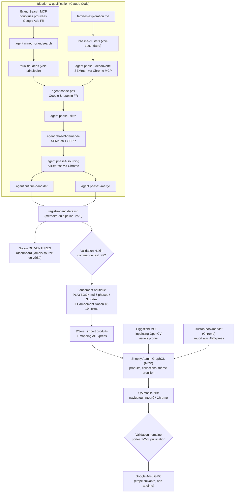

# 02 — Architecture actuelle (l'existant, pas la vision)

> Dossier de passation Codex — généré le 2026-07-30.
> Chaque affirmation porte une étiquette de source. Ce qui n'a pas été trouvé est marqué [MANQUANT], jamais supposé.
> Racine projet : `/Users/Hakim/Documents/Boutiques drop` · Dépôt git : `boutique-pipeline/`.

---

## 1. Vue d'ensemble

Le système actuel est un **pipeline semi-automatisé de dropshipping FR** piloté par Claude Code :
des documents markdown font office de base de données, des agents Claude exécutent les phases,
les MCP (Shopify, Notion, Brand Search, Chrome, Higgsfield) sont les bras. Il n'y a **aucun
service qui tourne en permanence** : tout est déclenché en session.

- Dépôt git : `boutique-pipeline/` — confirmé (`git rev-parse` OK). **[FAIT — repo:boutique-pipeline/.git]**
- Branche courante : `feat/boucle-chasse-clusters`, dernier commit du **21/07/2026** ; branche `main` en retard ; **aucun remote configuré** (`git remote -v` vide). **[FAIT — repo:.git]**
- La majorité du travail récent (tout `boutique-seiko-mod/`, `boutique-tufting/`, `dropilot/`, `docs/`, `reports/`…) est **non suivi par git** (untracked). **[FAIT — repo:`git status`]**
- Décision actée : **fichiers locaux = source de vérité, Notion = tableau de bord**. **[MÉMOIRE — notion-pipeline-boutiques.md]**

## 2. Schéma des flux principaux

**[FAIT — repo:.claude/skills+agents, PLAYBOOK.md, registre-candidats.md]** pour les flux ; l'étape Ads/GMC est planifiée (PLAYBOOK phase 6). **Tuftéo est publiée** sur `tufteo.com` depuis le 23/07, mais son statut « Ads lancées » reste [CONTRADICTOIRE] faute de trace locale ; Noirmont reste sous mot de passe, 0 commande. [FAIT — repo:boutique-tufting/project-state.md §23/07 + HTTP public 30/07 ; repo:boutique-seiko-mod/journal/2026-08-08-reprise-session.md]

## 3. Inventaire des composants

### 3.1 Corpus documentaire du dépôt (le « cerveau »)

| Composant | Rôle | Entrées | Sorties | Maturité | Fichiers |
|---|---|---|---|---|---|
| Critères canoniques | Source de vérité des seuils (150–400 € TTC, ≥ 10 000 recherches/mois FR, Google Ads Search, fournisseur AliExpress only) | décisions Hakim | référence lue par tous les agents | **Actif** (MAJ 20/07) | `PRODUCT-RESEARCH-CRITERIA.md` **[FAIT — repo]** |
| Playbook recherche produit | Méthode détaillée (protocoles SEMrush, SERP, AliExpress) | — | référence agents | Actif | `PRODUCT-RESEARCH-PLAYBOOK.md` **[FAIT — repo]** |
| Playbook boutique | 6 phases / 3 portes de validation humaine pour lancer une boutique | intake template | boutique construite | **Actif** | `PLAYBOOK.md` **[FAIT — repo]** |
| Registre central | Mémoire anti-doublon du pipeline, compteur candidats (**2/20**), viviers, familles balayées | rapports de phase | décisions Hakim | **Actif** (MAJ 24/07) | `registre-candidats.md` **[FAIT — repo]** |
| Rapports de phase | Preuves datées de chaque phase (0 à 5) | exécution agents | registre | Actif | `reports/*.md` (~50 fichiers) **[FAIT — repo]** |
| Specs de design | Contrats des agents et des boucles, validés par Hakim | — | agents `.claude/` | Actif | `specs/2026-07-17-*.md`, `specs/2026-07-20-*.md` **[FAIT — repo]** |
| Templates & référence | Gabarits (persona, intake, scorecard, project-state…), conventions (naming, GMC, livraison FR/BE/CH) | — | projets boutique | Actif | `templates/`, `reference/` **[FAIT — repo]** |
| Personas | Persona validé obligatoire avant tout copywriting (étape bloquante 1d) | recherche + avis | copywriting | Actif | `personas/persona-noirmont-2026-07-25.md`, `personas/persona-tufting-2026-07-19.md` **[FAIT — repo]** + règle **[MÉMOIRE — persona-obligatoire-copywriting.md]** |

### 3.2 Couche agents Claude Code (fortement dépendante de Claude)

| Composant | Rôle | Maturité | Fichiers |
|---|---|---|---|
| 3 skills projet | `/recherche-produit` (orchestrateur 5 phases), `/chasse-clusters` (boucle volume-first autonome), `/qualifie-idees` (voie hybride principale depuis le 20/07) | **Actif** | `../.claude/skills/{recherche-produit,chasse-clusters,qualifie-idees}/SKILL.md` **[FAIT — repo:../.claude]** — NB : ce dossier `.claude/` est au niveau `Boutiques drop/`, **hors du dépôt git** |
| 10 agents projet | `phase0-decouverte`, `phase1-ideation`, `phase2-filtre`, `phase3-demande`, `phase4-sourcing`, `phase5-marge`, `sonde-prix`, `critique-candidat`, `mineur-brandsearch` (+ orchestration fail-closed) | **Actif** | `../.claude/agents/*.md` **[FAIT]** |
| Mémoire persistante | 14 fiches (index `MEMORY.md`) : décisions, pièges, recettes — relues à chaque session Claude | **Actif** | `/Users/Hakim/.claude/projects/-Users-Hakim-Documents-Boutiques-drop/memory/` **[FAIT]** |
| Skills globaux | 38 skills dans `~/.claude/skills/` : 6 maison e-commerce (`customer-service-bot`, `google-ads-launcher`, `klaviyo-flow-builder`, `meta-ads-creator`, `performance-analyzer`, `q4-strategy-generator`, `seo-content-pipeline`, `shopify-product-creator`, `link-building-machine`…) + packs skills.sh installés le 26/07 (`cro`, `copywriting`, `ads`, `ad-creative`, `higgsfield-*`, `ui-ux-pro-max`, `brandkit`, `shopify-liquid`…) | Actif (les maison ads = « couche règles Hakim » à invoquer avec les packs) | `~/.claude/skills/` **[FAIT]** + **[MÉMOIRE — skills-sh-ecommerce-installes.md]** |
| Anciens skills archivés | `niche-scorer`, `competitor-analyzer`, `margin-calculator` (critères périmés de mars 2026) — **ne pas restaurer** | Abandonné | `~/.claude/skills-archive/` **[MÉMOIRE — pipeline-recherche-produit-agents.md]** (dossier non re-vérifié : [OBSOLÈTE POSSIBLE]) |

### 3.3 Code exécutable

| Composant | Rôle | Entrées | Sorties | Maturité | Dépendances / limites |
|---|---|---|---|---|---|
| Scripts starter-kit | `scripts/new_boutique.py` (scaffold projet), `validate_tokens.py`, `tokens_to_theme.py` (charte → `settings_data.json`) + tests `tests/` | `brand-tokens.json` | dossier projet, thème configuré | **Actif** (utilisé pour tufting) | Python 3 stdlib **[FAIT — repo:scripts/]** |
| **Dropilot** (package Python) | Pipeline batch de scoring produit : normalisation → dédup (SQLite) → scoring YAML → portes → rapports JSON/CSV/MD ; CLI (`run`, `init-db`, `process-inbox`, `bigbuy-fetch`, `map-source`, `ads-import`, `serve` = webhook HTTP) | fichiers `data/inbox/`, API BigBuy | `reports/`, `data/dropilot.sqlite3` | **Prototype non exploité** : aucun `.env`, aucune base SQLite présente, `data/inbox/` vide, aucun rapport dropilot dans `reports/` (que des rapports d'agents) **[FAIT — repo:dropilot/, data/, .env absent]** | config `config/pipeline.yaml` ; tests `tests_dropilot/` existent |
| Déploiement dropilot | Dockerfile, compose, unités systemd (`dropilot-webhook.service`, `dropilot-research.timer` lun-ven 06:30), scripts `automation/` | — | service VPS | **Jamais déployé d'après le dépôt** (aucune trace d'exécution, chemins `/opt/dropilot` théoriques) | `deploy/`, `automation/`, `docs/HERMES-VPS.md`, `docs/OPERATIONS.md`, `docs/ROUTINE-HEBDOMADAIRE.md` **[FAIT — repo]** |
| Scripts boutique Noirmont | ~10 scripts ad hoc `.mjs`/`.py` : préparation visuels, staged uploads Shopify, worklists galeries, QA planches, alignement images, swatches PIL | images locales | mutations GraphQL + fichiers QA | **Prototype / one-shot** (écrits par sessions, réutilisables mais non génériques) | `boutique-seiko-mod/*.mjs`, `*.py`, `boutique-seiko-mod/livraisons/swatches-2026-07-25/gen_swatches.py` **[FAIT — repo]** |
| Kit Liquid portable | Sections indépendantes du thème (paiement fractionné, réassurance, FAQ, icônes) | — | à copier dans un thème | Actif | `shopify-portable/`, copie dans `boutique-tufting/shopify/portable-kit/` **[FAIT — repo]** |
| Référence Horizon | Export complet page produit / panier / homepage du thème Horizon (byte-exact, MD5), répliqué dans Notion | — | reconstruction de PDP | Actif (référence) | `docs/horizon-product-page-reference/` **[FAIT — repo]** + **[MÉMOIRE — notion-pipeline-boutiques.md]** |

### 3.4 Espaces boutiques

| Boutique | État | Fichiers |
|---|---|---|
| **Maison Noirmont** (Seiko mod / montres cadran stérile) — `v42pzp-h4.myshopify.com` / `maisonnoirmont.fr` | **La plus fraîche** : 92 fiches actives, DSers 98 mappés, thème de travail `204248088914` (UNPUBLISHED) à republier, boutique sous mot de passe, 0 commande. Chantier en cours : configurateur/guide de choix V2 livré. Lire `boutique-seiko-mod/journal/2026-08-08-reprise-session.md` en premier. **[FAIT — repo:boutique-seiko-mod/journal/2026-08-08-reprise-session.md]** — connexion MCP Shopify actuelle = ce shop (« Maison Noirmont », plan Basic, EUR) **[FAIT — Shopify API get-shop-info]** | `boutique-seiko-mod/` (~110 fichiers + backups images) |
| **Tuftéo** (kits tufting) | `et0hua-w1.myshopify.com` / `tufteo.com`, thème live `188623847809`, publiée le 23/07. Catalogue DSers francisé, avis Trustoo importés ; **P0 : 6 avis fictifs « Vérifié » + compteur 789 confirmés publics**. Accès CLI/API [MANQUANT]. **[FAIT — repo:boutique-tufting/project-state.md + HTTP/navigateur public 30/07]** | `boutique-tufting/` |
| Anciennes boutiques (hors dépôt) | Bien Brûlé (`2npa6w-x0`, bienbrule.com — suspendue GMC pour misrepresentation), Lihyl (`s001ti-nw`, lihyl.fr) | dossiers frères `../Bien Brulé/`, `../lihyl-lancement/` + `../CONTEXTE-MEMOIRE-pour-Codex.md` (export du 23/06, **partiellement périmé**) **[FAIT — repo parent]** [OBSOLÈTE POSSIBLE] |
| Espace Codex | `codex-chasse-clusters/` : adaptation Codex de la boucle volume-first, volontairement isolée. Run `20260720-124517` **terminé** : 40/40 familles, 110 clusters, 17 thématiques `RETENU_MARCHE_A_SOURCER` (AliExpress inaccessible à Codex → sourcing manuel) | `codex-chasse-clusters/` **[FAIT — repo]** |

### 3.5 Outils MCP réellement utilisés (preuves d'usage dans le dépôt)

| MCP / outil | Usage réel constaté | Limites connues |
|---|---|---|
| **Shopify Admin GraphQL** (connecteur MCP) | Produits, collections, publications (`publishablePublish`), metafields, staged uploads, `themeFilesUpsert` sur thème brouillon — tout le build Noirmont | Refuse d'écrire sur un thème MAIN ; **`switch-shop` interdit** (invalide la connexion pour tous) ; requêtes média plafonnées à 30 ; écritures thème asynchrones (`upsertedThemeFiles: []` ≠ échec) **[FAIT — repo:boutique-seiko-mod/journal/2026-08-08-reprise-session.md §Pièges]** |
| **Notion** (workspace OH VENTURES) | Hub « Pipeline Boutiques Drop » : bases Recherches produit + Boutiques, Campement type (Kanban 18-19 tickets à dupliquer par lancement), modèles Horizon | `query_data_sources` limité (plan) ; Notion = dashboard, jamais source de vérité **[MÉMOIRE — notion-pipeline-boutiques.md, campement-type-lancement-boutique.md]** |
| **Brand Search** (MCP `909b5b93-…`) | Source d'idées principale depuis le 20/07 : boutiques FR vivant en Google Ads sans Meta, prix ≥ ~130 $ | Quota 10 000 req/mois ; paramètre `markets` inopérant (utiliser `country_code: FR`) ; repli UI web app.brandsearch.co **[MÉMOIRE — brand-search-source-idees.md]** + rapports `reports/minage-brandsearch-2026-07-20.md` **[FAIT — repo]** |
| **claude-in-chrome** (Chrome de Hakim) | SEMrush (sessions connectées), DSers (session `contact.noirmont`), AliExpress (sourcing + relevés variantes), Trustoo bookmarklet (import avis), admin Shopify en rendu | Dépend des **sessions Chrome ouvertes de Hakim** ; interdiction absolue de saisir identifiants/mots de passe **[FAIT — repo:boutique-seiko-mod/dsers-mapping-*.md]** |
| **Higgsfield** (images IA) | Visuels produit Noirmont (galeries, swatches) | Imprime de faux logos sur les cadrans → compositions cachant le cadran + inpainting OpenCV local **[MÉMOIRE — shopify-canal-et-visuels-ia.md]** + `boutique-seiko-mod/livraisons/visuels-2026-07-25/` **[FAIT — repo]** |
| Navigateur intégré | QA mobile 375×812, mesures contraste/cibles tactiles | Pas d'export fichier des captures **[FAIT — repo:audit-uiux-*.md]** |
| SEMrush (compte **payant**, récent) | Volumes FR, Keyword Magic, mesure express | ⚠️ [CONTRADICTOIRE — `../CONTEXTE-MEMOIRE-pour-Codex.md` (23/06 : « pas de compte permanent, essais ponctuels, Semrush OFF par défaut ») vs `boutique-seiko-mod/journal/2026-08-08-reprise-session.md` + `boutique-seiko-mod/journal/2026-07-31-marche-complet-semrush.md` (27/07 : « SEMrush (compte payant) »)]. Résolution probable : abonnement souscrit entre-temps ; la mention PLAYBOOK « Semrush désactivé par défaut » est périmée. **À valider par Hakim.** |

### 3.6 n8n, Apify, VPS, Browser Use — l'écart vision / existant

- **n8n** : cité uniquement comme intégration *future* dans `docs/HERMES-VPS.md` et `docs/OPERATIONS.md` (exemple d'appel HTTP vers le webhook dropilot) et dans l'archive `recherche-prod-extracted/PROMPT_CLAUDE_CODE.md`. Un vieux POC hors dépôt : `../ecommerce-dropshipping/workflow_poc_GMAIL_oauth_P1.json`. **[FAIT — repo]** Aucun n8n installé ou configuré nulle part : élément de vision cible, pas de l'existant.
- **VPS / Hermes** : `docs/HERMES-VPS.md` + `deploy/systemd/` sont des **instructions d'installation jamais exécutées** d'après le dépôt (aucun log, aucun état, chemins `/opt/dropilot` théoriques). [MANQUANT] toute preuve d'un VPS réel (IP, inventaire, clé) — élément de vision cible.
- **Browser Use** : une seule trace, côté **Codex** : le run `codex-chasse-clusters` a échoué sur AliExpress avec l'erreur littérale « Browser Use rejected this action due to browser security policy » (`codex-chasse-clusters/run-state.json`, `reports/validation-multimarche-brandsearch-….md`). **[FAIT — repo]** C'est l'outil navigateur de l'environnement Codex utilisé le 20/07, pas une brique installée dans ce projet.
- **Apify** : **[MANQUANT] aucune trace dans le dépôt** (ni code, ni config, ni mention) — élément de vision cible, pas de l'existant.

## 4. Stockage

- **Fichiers locaux markdown = source de vérité** (registre, rapports, project-state, backups JSON avant chaque mutation Shopify). **[MÉMOIRE — notion-pipeline-boutiques.md]** + pratique constatée partout dans le dépôt **[FAIT]**.
- **Notion = dashboard** (bases candidats/boutiques, campement type). **[MÉMOIRE]**
- **Shopify = état d'exécution** (produits, thèmes) ; chaque lot de travail laisse un backup local avant/après. **[FAIT — repo:boutique-seiko-mod/backup-*]**
- **SQLite dropilot** : prévu, **absent** (`data/` ne contient que `inbox/` vide). **[FAIT — repo]**
- Scratchpads : `boutique-pipeline/scratchpad/` (backups Noirmont), `boutique-seiko-mod/scratchpad/`, et `../scratchpad/` au niveau racine (backups configurateur/publication, 26–30/07). **[FAIT — repo + parent]**

## 5. Ce qui tourne aujourd'hui, concrètement

Rien en continu. Une session type = Claude Code ouvert dans `Boutiques drop/`, qui lit la mémoire,
lance des skills/agents, pilote Chrome et les MCP, écrit des rapports markdown et des backups.
Les scripts Python/Node sont lancés à la main dans la session. **[FAIT — constaté sur l'ensemble du dépôt]**
