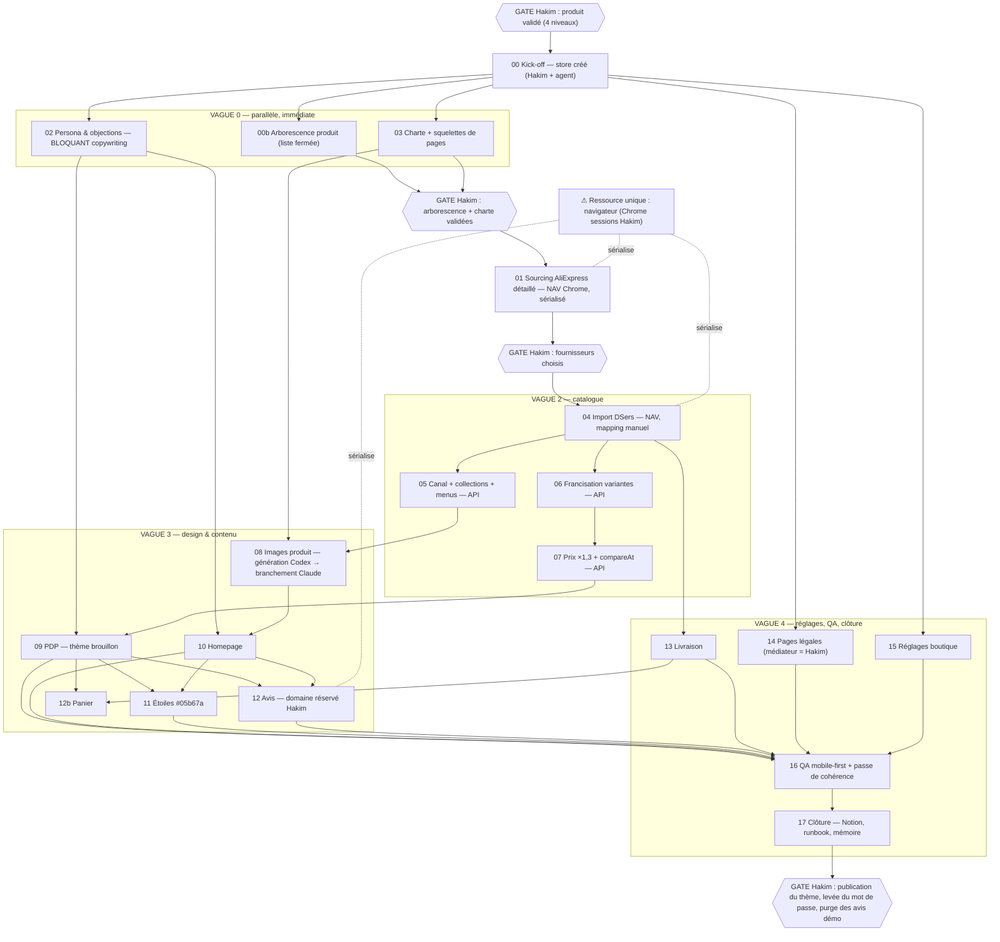

# 16 — Orchestration multi-agents : le mode opératoire réel de Claude Code

> Dossier de passation Codex — rédigé le 2026-07-31.
> ⚠️ **Pourquoi « 16 » alors que la demande disait « 14 »** : les numéros 14 (`14-PROTOCOLE-ORDRES.md`)
> et 15 (`15-CODEX-EXECUTANT-IMAGES.md`) étaient déjà pris par le protocole d'ordres créé le matin même.
> Ce document est donc le 16, sans autre signification.
>
> **Rôle de ce document** : reconstituer comment Claude Code a réellement travaillé en chef d'équipe
> multi-agents sur ce projet — quels sous-agents, comment ils sont briefés, comment ils sont parallélisés,
> comment leurs résultats sont contrôlés, fusionnés et repris après incident — pour que Codex (ou tout autre
> orchestrateur) puisse reproduire le comportement, pas seulement lire les livrables.
> Il ne duplique ni l'inventaire des agents (`03-AGENTS-AND-WORKFLOWS.md`) ni le catalogue des pièges
> (`10-FAILURES-AND-LESSONS.md`) : il les référence et décrit **le comportement d'orchestration** qui les relie.
>
> Étiquettes de source, plus strictes ici que dans le reste du dossier :
> - **[FAIT — repo:chemin]** : un livrable du dépôt en témoigne (chemin relatif à `boutique-pipeline/`
>   sauf mention contraire).
> - **[RECONSTITUÉ — mémoire d'orchestration]** : principe réellement pratiqué en session, dicté par
>   l'orchestrateur lors de la passation — la trace écrite est indirecte (elle se lit dans la forme des
>   livrables, pas dans un document de doctrine).
> - **[NOTION]** : base « Tickets — Lancement boutique (modèle) » (`da8b39cc1a4248f2aec7494df5ef247b`,
>   ds `139e0897-…`), relue le 31/07 — 20 tickets, ordres et dépendances vérifiés ligne à ligne.
>
> Règle de fiabilité : chaque affirmation d'exemple cite son livrable. Ce qui n'a pas de livrable est
> étiqueté [RECONSTITUÉ] et doit être traité comme un principe à re-prouver, pas comme un fait.

---

## 1. Les sous-agents — qui compose l'équipe

Trois familles de « bras », de nature différente **[RECONSTITUÉ — mémoire d'orchestration]**, chacune
attestée par ses livrables :

### 1.1 Les agents enregistrés du pipeline produit (9)

`phase0-decouverte` → `phase5-marge`, `sonde-prix`, `critique-candidat`, `mineur-brandsearch` —
définis dans `.claude/agents/*.md`, lancés par les 3 skills orchestrateurs. **Inventaire complet, outils,
gates et statuts : `03-AGENTS-AND-WORKFLOWS.md` §2-3** — non dupliqué ici. Ce qui compte pour
l'orchestration : ce sont des agents **à contrat permanent** (le brief vit dans le fichier d'agent, les
critères chiffrés vivent dans `PRODUCT-RESEARCH-CRITERIA.md` relu à chaque mission, jamais recopiés),
séquencés par les skills, **jamais en parallèle sur le chemin A** [FAIT — repo:.claude/skills/recherche-produit/SKILL.md].

### 1.2 Les agents de chantier ad hoc (boutiques)

La construction de Noirmont (24-30/07) n'a **pas** utilisé d'agents enregistrés : chaque chantier a reçu
un **brief jetable, autoportant, écrit pour l'occasion** par l'orchestrateur, et a laissé un livrable
markdown daté qui est la trace du brief (périmètre, interdits, contrôles s'y lisent en creux).
Exemples nommables, tous [FAIT — repo:boutique-seiko-mod/] :

| Agent de chantier (reconstitué) | Livrable-trace | Périmètre exclusif tenu |
|---|---|---|
| Correcteur thème **JSON** | `fix-uiux-json.md` | 5 fichiers `config/` + `templates/` — « Aucun `.liquid`, aucun `assets/` » |
| Correcteur thème **assets** | `fix-uiux-assets.md` | « `assets/` uniquement — 1 CSS + 6 JS. Aucun `.json`, aucun `.liquid` » |
| Correcteur thème **Liquid** | `fix-uiux-liquid.md` | 10 fichiers `.liquid` — « Aucun `.json`, aucun `assets/` » |
| Brancheur de galeries | `branchement-galeries-codex.md` | uploads + rattachements médias, **0 média supprimé** |
| Sourceur de grappes | `sourcing-arabes-squelettes.md` | 5 fiches DRAFT, « aucune fiche existante touchée » |
| Vérificateur de véracité | `verification-catalogue-strategie.md`, `fiches-contradictoires-et-cadran-arabe.md` | lecture + passage en DRAFT, aucune suppression |
| Auditeurs UI/UX (lecture seule) | `audit-uiux-home.md`, `audit-uiux-produit.md`, `audit-uiux-panier.md` | constat pur, aucune écriture |
| Passe de cohérence finale | `passe-coherence-avant-publication.md` | mesure tout, ne corrige que son mandat |

### 1.3 L'exécutant externe : Codex

Deux précédents documentés (`03` §8) : la boucle chasse-clusters isolée (20/07) et surtout **les galeries
Noirmont** — Codex générateur d'images en local, contrat écrit `PROMPT-CODEX-galeries.md`, interdiction
absolue de toucher Shopify, branchement resté côté Claude Code : **85 fiches, 206 médias**
[FAIT — repo:boutique-seiko-mod/branchement-galeries-codex.md]. Le 31/07 au matin ce rôle avait été
institutionnalisé (décision D-0731-A : ordres `generate_images` dans `ordres/pour-codex/`) ; **supersédé le
soir même par D-0731-B** — Codex reprend l'orchestration et génère les images nativement selon la
spécification `15-CODEX-EXECUTANT-IMAGES.md`
[FAIT — repo:docs/codex-handoff/05-DECISION-LOG.md D-0731-B, 14-PROTOCOLE-ORDRES.md §9].

---

## 2. Fiche type d'un sous-agent — l'anatomie du brief

**C'est le cœur du mode opératoire.** Chaque brief d'agent contient les 7 blocs suivants
**[RECONSTITUÉ — mémoire d'orchestration]** ; chaque bloc est illustré par sa trace dans un livrable réel.

### 2.1 Contexte autoportant + fichiers de référence à lire

Le brief ne suppose aucune mémoire partagée : il raconte la boutique, l'objectif, et **liste les fichiers
à lire d'abord**. Trace canonique : `PROMPT-CODEX-galeries.md` s'ouvre sur « Il est autoportant », décrit
le catalogue (92 fiches, 85 à traiter) et renvoie à `audit-visuel-catalogue.md`, désigné « feuille de
route de Codex » [FAIT — repo:boutique-seiko-mod/audit-visuel-catalogue.md l.6]. Les briefs internes font
pareil : `fix-uiux-assets.md` cite ses sources (`audit-uiux-home.md`, `audit-uiux-panier.md`).

### 2.2 Périmètre exclusif de fichiers — « tu n'écris que X »

Jamais deux agents sur les mêmes fichiers (voir §3). Le périmètre est **énoncé en positif et en négatif**,
et les livrables prouvent qu'il a été tenu : « Périmètre tenu : `assets/` uniquement — 1 CSS + 6 JS.
Aucun `.json`, aucun `.liquid`, aucun `snippets/` » [FAIT — repo:boutique-seiko-mod/fix-uiux-assets.md] ;
« Hors des 6 points confiés : **non appliqué**, soumis à arbitrage »
[FAIT — repo:boutique-seiko-mod/fix-uiux-json.md].

### 2.3 Interdits ⛔ explicites

Toujours une section d'interdits absolus, en tête. `PROMPT-CODEX-galeries.md` : « Ne te connecte pas à
Shopify […] Ne modifie aucun SKU […] N'invente aucune caractéristique produit […] Pas d'inpainting »
[FAIT — repo:boutique-seiko-mod/PROMPT-CODEX-galeries.md]. Le même patron est devenu la section « ⛔
Interdiction absolue » de `15-CODEX-EXECUTANT-IMAGES.md`. Les interdits transverses (jamais de secret,
jamais de publication, jamais de CAPTCHA) sont dans `12-CODEX-INSTRUCTIONS.md` §6.

### 2.4 Les pièges déjà payés ⚠️, recopiés dans chaque brief concerné

**C'est le mécanisme de capitalisation du projet** [RECONSTITUÉ — mémoire d'orchestration] : une leçon
apprise (consignée dans `10-FAILURES-AND-LESSONS.md` et le campement Notion) est **recopiée dans le corps
de chaque brief suivant qu'elle concerne** — l'agent n'a pas à la chercher. Traces :
- « La dernière fois, le manifeste était indexé sur des **identifiants de variante devenus périmés avant
  même d'être lus** […] On ne recommence pas » — le piège du 26/07 recopié dans le prompt Codex suivant
  [FAIT — repo:boutique-seiko-mod/PROMPT-CODEX-galeries.md §Nommage].
- Les modèles proscrits (UGC/mode = faux logos, édition = objet réinventé) recopiés du bake-off du 25/07
  dans le prompt galeries, puis dans `15-CODEX-EXECUTANT-IMAGES.md` [FAIT — les trois fichiers].
- Le bloc « MANDATORY ORIENTATION » né des deux échecs d'orientation du chantier aviateur, réinjecté dans
  les prompts suivants [FAIT — repo:boutique-seiko-mod/visuels-aviateur-consolidation.md l.253-257 ;
  sourcing-arabes-squelettes.md §4 « bloc MANDATORY ORIENTATION renforcé »].

### 2.5 Contrôles exigés — mesurer, pas estimer

Le brief impose ses vérifications : planches de contrôle, comptages programmatiques, relectures par
empreinte. `PROMPT-CODEX-galeries.md` §13 : planche par famille, planche de zoom des cadrans,
« Vérification programmatique : les 390 fichiers font bien 2048 × 2048 », « Grep-le pour t'en assurer »,
« **Si ton compte final diffère, ne livre pas : explique l'écart** » [FAIT — repo]. Côté interne :
relecture MD5 après chaque écriture de thème [FAIT — repo:boutique-seiko-mod/fix-uiux-liquid.md,
fix-uiux-json.md].

### 2.6 Livrable nommé + rapport final plafonné

Le brief nomme le fichier de sortie (markdown daté, ou « réponse directe, sans créer de fichier » pour
les agents de verdict — [FAIT — repo:.claude/agents/critique-candidat.md l.84]) et **plafonne le rapport
final** (« N lignes max », sections imposées) pour que l'orchestrateur fusionne sans relire des pavés
[RECONSTITUÉ — mémoire d'orchestration ; trace indirecte : les formats de sortie imposés des 9 agents,
`03` §3, et le « Rapport final : le décompte réel par bloc… » de `PROMPT-CODEX-galeries.md` §13].

### 2.7 Ce que le brief ne décide pas : les domaines réservés

Chaque brief rappelle les frontières de Hakim quand le chantier les côtoie : preuve sociale/avis démo,
publication, prix, achats — « **La preuve sociale reste la chasse gardée de Hakim** »
[FAIT — repo:boutique-seiko-mod/passe-coherence-avant-publication.md §4.3 « domaine réservé de Hakim —
non touchées » ; mémoire : mobile-first-et-placeholders-demo].

---

## 3. Règles de parallélisation

**[RECONSTITUÉ — mémoire d'orchestration]**, chacune payée puis prouvée par un livrable :

1. **Jamais deux agents sur les mêmes fichiers.** L'exemple canonique est le découpage du chantier thème
   du 26/07 en trois agents étanches par **type de fichier** : JSON (`fix-uiux-json.md`) / assets CSS+JS
   (`fix-uiux-assets.md`) / Liquid (`fix-uiux-liquid.md`). Chaque livrable déclare et prouve son étanchéité
   (tables d'empreintes disjointes), et `fix-uiux-json.md` note explicitement que « le travail des agents
   CSS/Liquid en parallèle est intact » [FAIT — repo:boutique-seiko-mod/, les 3 fichiers].
2. **Le navigateur est une ressource unique.** Leçon de la nuit du 25/07 : « Deux consommateurs simultanés
   = onglets qui se re-naviguent. Sérialiser tout usage du navigateur » — la QA du thème a été *reportée*
   parce qu'un agent de sourcing naviguait [FAIT — repo:boutique-seiko-mod/journal-nuit-2026-07-25.md §Enseignements].
   Répartition pratiquée ensuite : **Chrome connecté de Hakim** (sessions AliExpress/DSers/SEMrush) pour un
   seul agent à la fois, **navigateur intégré isolé** pour les rendus de prévisualisation — en sachant que
   l'intégré n'a pas de session (c'est lui qui produisait les faux CAPTCHA AliExpress, `10` A1) et qu'il
   faut **vérifier le compte de la session Chrome avant d'agir** (contrôle DSers reporté le 29/07 :
   « session Chrome sur le mauvais compte ») [FAIT — repo:boutique-seiko-mod/sourcing-arabes-squelettes.md l.10].
3. **Écritures de thème sérialisées, lectures libres.** Les trois agents thème écrivaient dans des
   périmètres disjoints mais les mutations Shopify d'un même objet (produit, thème) ne se croisent jamais ;
   les lectures (audits, mesures) tournent librement en parallèle. Corollaire : quand deux dispositifs
   cohabitent (Claude + Codex chasse-clusters), l'isolation se fait **par espace de travail + empreintes
   SHA256** — une modification concurrente a été détectée et documentée sans écrasement le 20/07
   [FAIT — repo:codex-chasse-clusters/ ; `03` §8].
4. **Le pipeline produit, lui, est volontairement séquentiel** (fail-closed de phase en phase, registre mis
   à jour entre chaque) — la parallélisation y serait un défaut, pas une optimisation
   [FAIT — repo:.claude/skills/recherche-produit/SKILL.md « séquentiellement, jamais en parallèle »].

---

## 4. Les vagues réelles d'un lancement de boutique

Source de structure : le campement type Notion — **20 tickets, ordre et dépendances vérifiés le 31/07**
[NOTION — db `da8b39cc…`, champ `Dépend de` relevé ticket par ticket]. Source de vécu : les livrables
datés de Noirmont (le campement idéalise en « une journée » ce que Noirmont a étalé sur une semaine).

| Vague | Contenu | Barrière d'entrée | Tickets [NOTION] | Trace Noirmont [FAIT — repo:boutique-seiko-mod/] |
|---|---|---|---|---|
| **0 — immédiate** | arborescence produit (liste fermée), persona & objections, charte + squelettes de pages | kick-off fait (00 : store créé par Hakim — dépend du « Produit validé GO ») | 00b, 02, 03 — tous trois ne dépendent que de 00, donc **parallélisables** | `arborescence-site-2026-07-24.md` ; `personas/persona-noirmont-2026-07-25.md` ; `charte-noirmont-2026-07-25.md` |
| **1 — après validation produit** | sourcing AliExpress détaillé (liens `/item/`, prix rendus, délais) | arborescence **validée par Hakim** (01 dépend de « 00b (arborescence validée) ») | 01 | `fournisseurs-reponses-2026-07-24.md`, sourcing phase4b/c/d du 24/07 |
| **2 — après choix fournisseur** | import DSers (mapping intact), canal + collections + menus, francisation des variantes, prix ×1,3 | fournisseurs arrêtés | 04 → 05 et 06 (les deux dépendent de 04) → 07 (dépend de 06) | `dsers-mapping-decoupage-2026-07-25.md`, `decoupage-coloris-lot1-2026-07-25.md`, `publication-grappes.md` |
| **3 — après visuels** | génération d'images (Codex), branchement galeries + images de variantes, PDP, homepage, avis, panier | charte validée + catalogue en place (08 dépend de 03+05 ; 09 de 02+03+07 ; 10 de 02+03+08 ; 12b de 05+09+13) | 08, 09, 10, 11, 12, 12b | `PROMPT-CODEX-galeries.md` → `branchement-galeries-codex.md` (26/07, 85 fiches/206 médias) ; `journal-nuit-2026-07-25.md` (24 visuels → 120 variantes) |
| **4 — finale** | livraison, pages légales, réglages, QA mobile-first, passe de cohérence, clôture — puis **validation humaine de publication** | tout le contenu posé (16 dépend de 09,10,11,12,13,14,15 ; 17 de 16) | 13, 14, 15 → 16 → 17 | `pages-legales-et-delais.md`, `passe-coherence-avant-publication.md`, `REPRISE-SESSION.md` §Ce qui attend Hakim |

Deux réalités à ne pas gommer :
- **La barrière finale n'a jamais été franchie** : Noirmont est restée sous mot de passe, thème UNPUBLISHED —
  la publication est un gate Hakim, pas une étape d'agent [FAIT — repo:boutique-seiko-mod/REPRISE-SESSION.md].
- Les vagues **se re-déclenchent** : chaque découverte de véracité (fiches contradictoires du 27/07,
  grappes non servies du 29/07) a rouvert une mini-vague sourcing → visuels → branchement, avec les mêmes
  barrières [FAIT — repo:boutique-seiko-mod/fiches-contradictoires-et-cadran-arabe.md,
  sourcing-arabes-squelettes.md].

---

## 5. Graphe des dépendances (vagues + barrières)

Dépendances = champ `Dépend de` des tickets Notion [NOTION] ; contraintes de ressources = §3.



Lecture : les `GATE` sont des **barrières humaines** (jamais franchies par un agent) ; à l'intérieur d'une
vague, tout ce qui n'écrit pas les mêmes fichiers et ne tient pas le navigateur tourne en parallèle.

---

## 6. Comportement d'orchestrateur

Six comportements **[RECONSTITUÉ — mémoire d'orchestration]**, chacun ancré dans ses livrables.

### 6.1 Détection d'un résultat faible

- **Exiger des mesures, refuser les déductions.** Deux constats de contraste se sont contredits sur le même
  bandeau : « 3,0:1 » annoncé (déduit d'une valeur de couleur) contre **18,81:1 mesuré sur le rendu, opacité
  héritée composée** — « les deux moitiés du constat sont fausses, mesures à l'appui — donc aucune écriture »
  [FAIT — repo:boutique-seiko-mod/fix-uiux-json.md §Contraste du bandeau]. Dans l'autre sens, le balayage du
  coordinateur a pris en défaut la correction d'un agent : 5,6:1 annoncé (calculé sur `color`), **1,28:1 réel**
  sur schéma sombre — refaite et mesurée [FAIT — repo:boutique-seiko-mod/fix-uiux-assets.md §Contraste du
  prix barré]. Le principe général est `10` F1.
- **Mots-clés témoins.** SEMrush à quota épuisé rend « Tous les mots clés : 0 » **sans erreur** — quatre
  requêtes vidées silencieusement avant détection ; depuis, aucun zéro n'entre dans un rapport sans témoin
  massif validé dans la même session [FAIT — repo:boutique-seiko-mod/mots-cles-semrush.md §0 ;
  marche-complet-semrush.md §0].
- **Croiser deux agents sur le même objet quand le doute existe.** La passe de cohérence a re-balayé ce que
  les audits signalaient : le signalement disait 5 familles de cibles tactiles fautives, le re-balayage en a
  trouvé **15 dans 18 contextes** — et 0 sur le configurateur, « ce qui explique la contradiction du
  signalement » [FAIT — repo:boutique-seiko-mod/passe-coherence-avant-publication.md §8.2].
- **Un chiffre qui fonde une purge se recompte par une autre voie.** Inventaire de purge : 173 photos
  fournisseur ; recomptage par `mediaCount` : **186** — le plafond de 30 médias/requête tronquait
  l'inventaire, 13 photos auraient survécu [FAIT — repo:boutique-seiko-mod/visuels-accessoires-lot4.md
  l.92-100 ; `10` A6].

### 6.2 Relance et reprise après interruption

- **Règle n°1 : « établis l'état réel par des mesures avant d'agir. »** La reprise du 29/07 au soir en est
  le cas d'école : agent interrompu, transcript principal perdu ; l'orchestrateur a d'abord mesuré (traces
  `subagents/*.jsonl` + historique Higgsfield + relecture Shopify) et découvert **24 générations déjà payées
  (92 crédits) dont les 23 images 4K dormaient dans l'historique Higgsfield** — tout a été re-téléchargé et
  re-QA, **0 crédit reperdu** [FAIT — repo:boutique-seiko-mod/sourcing-arabes-squelettes.md §5].
- **Idempotence** : ne pas régénérer ce qui existe, ne pas re-supprimer ce qui l'est déjà. Les prompts de
  reprise s'ouvrent sur « Ce qui est déjà fait — ne le refais pas »
  [FAIT — repo:boutique-seiko-mod/ARCHIVE-prompt-reprise-visuels-2026-07-25.md.bak] ; le protocole d'ordres
  formalise l'idempotence par `id` [FAIT — repo:docs/codex-handoff/14-PROTOCOLE-ORDRES.md §6].
- **Relais des verdicts entre agents qui ne peuvent pas se joindre** : le QA partiel de l'agent interrompu a
  été **retrouvé dans son transcript** et intégré tel quel (« 5 situations v2 validées […] régénérés sans
  contrôle ») au lieu d'être refait ou ignoré [FAIT — même fichier §5] ; les journaux de nuit sont le même
  mécanisme vers Hakim endormi [FAIT — repo:boutique-seiko-mod/journal-nuit-2026-07-25.md, -suite.md].

### 6.3 Arbitrage des contradictions

- **La preuve prime, et chaque type de vérité a sa preuve** : l'identité produit se prouve par la **chaîne
  SKU confrontée au listing vendeur** (8/8 puis 11/11 libellés identiques — « le mapping est juste, ce sont
  les fiches qui sont mal conçues ») [FAIT — repo:boutique-seiko-mod/fiches-contradictoires-et-cadran-arabe.md §1] ;
  les écritures se prouvent par **empreintes sur les octets envoyés** [FAIT — repo:boutique-seiko-mod/fix-uiux-*.md ;
  `10` B1].
- **Quand deux agents se contredisent, mesure directe par un tiers** — cf. 6.1 (contrastes, cibles tactiles).
- **Un agent qui refuse une autorisation mal fondée a raison** (`10` F5). Deux cas réels au-delà des refus
  d'outillage :
  1. Autorisation de supprimer 16 médias **conditionnée à une sauvegarde** : « Aucune sauvegarde locale
     n'existait » — vérifié par recherche de motifs sur tout le dossier ; l'agent a téléchargé les 16
     fichiers d'abord (manifeste, réouverture vérifiée 16/16) puis seulement supprimé
     [FAIT — repo:boutique-seiko-mod/visuels-aviateur-consolidation.md §8.1].
  2. Ordre de masquer les étoiles d'avis (`aria-hidden`) « **si** la note chiffrée est affichée à côté » :
     « Vérifié en rendu : la condition n'est pas remplie » — les étoiles étaient le seul porteur de la note ;
     ordre non exécuté, recommandation inverse documentée
     [FAIT — repo:boutique-seiko-mod/fix-uiux-assets.md §Étoiles d'avis].

### 6.4 Force de proposition sans exécution

- **Sur l'irréversible et le domaine réservé : signaler + proposer + attendre.** Le badge « 1340 avis »
  invisible (1,00:1) est *mesuré et documenté*, jamais corrigé : « la mesure est là si Hakim préfère le
  corriger plutôt que le retirer » [FAIT — repo:boutique-seiko-mod/passe-coherence-avant-publication.md §4.3].
  Idem le sort des 6 faces SWISS MADE : « l'arbitrage (regénérer ? retoucher ? masquer ?) t'appartient »
  [FAIT — repo:boutique-seiko-mod/branchement-galeries-codex.md l.144].
- **Trancher seul le réversible, en le journalisant** : passages en DRAFT (réversibles, sauvegardés) décidés
  et exécutés sans attendre, avec l'enveloppe de preuves
  [FAIT — repo:boutique-seiko-mod/fiches-contradictoires-et-cadran-arabe.md, en-tête].
- **Requalifier plutôt que rejeter** : un ordre limite ne meurt pas, il change de classe — le protocole
  d'ordres route la classe C vers `attente-hakim/`, « jamais exécutés sans validation humaine »
  [FAIT — repo:docs/codex-handoff/14-PROTOCOLE-ORDRES.md §2, §4].

### 6.5 Fusion des résultats

- **Un livrable markdown daté par chantier** (convention `12` §2), qui contient le rapport de l'agent *et*
  les preuves (tables d'empreintes, comptages, sauvegardes).
- **`REPRISE-SESSION.md` = l'état consolidé toujours à jour** : l'orchestrateur y reverse ce qui survit aux
  sessions (état, pièges, « ce qui attend Hakim ») ; c'est le premier fichier de toute reprise
  [FAIT — repo:boutique-seiko-mod/REPRISE-SESSION.md ; règle de lecture dans `12` §1].
- **Les corrections aux briefs de l'orchestrateur sont consignées par les agents eux-mêmes** — le flux
  d'information remonte : « Le brief de mission annonçait 9 fiches sans diamètre […] Le relevé API du 30/07
  en donne **11** » [FAIT — repo:boutique-seiko-mod/seo-titles-produits.md §6] ; « ⚠️ **36, et non 31.** Le
  chiffre de 31 qui figure dans le prompt vient de la version 1 de cet audit […] C'est ce document qui fait
  foi » [FAIT — repo:boutique-seiko-mod/audit-visuel-catalogue.md l.234] ; la fiche mémoire disait « 18
  tickets » (puis 19), le comptage Notion direct en donne **20** — « Notion fait foi, comptage direct »
  [FAIT — repo:docs/codex-handoff/03-AGENTS-AND-WORKFLOWS.md §5 ; NOTION — revérifié le 31/07].

### 6.6 Fail-closed partout

Hérité du pipeline produit et appliqué aux chantiers : donnée invérifiable, page qui ne charge pas,
session expirée, CAPTCHA → **arrêt déclaré, jamais un chiffre estimé** (`12` §2 ; `03` §1). Le corollaire
d'orchestration : un livrable non conforme = **arrêt de chaîne, pas de rattrapage silencieux**
[FAIT — repo:.claude/skills/recherche-produit/SKILL.md].

---

## 7. Pseudo-code exécutable pour Codex

Style : proche du réel (primitives d'une session d'orchestration), pas académique.

```python
# ------------------------------------------------------------------
# Orchestration d'un lancement de boutique — patron réellement pratiqué
# Références : tickets Notion 00→17 [NOTION], briefs §2, règles §3, gates §4
# ------------------------------------------------------------------

RESSOURCES = {
    "chrome_hakim": Verrou(),      # sessions AliExpress/DSers/SEMrush — UN agent à la fois
    "theme_brouillon": Verrou(),   # écritures de thème sérialisées
}
DOMAINES_RESERVES_HAKIM = {"publication", "avis_demo", "achats", "prix_decision",
                           "mediateur", "reglages_compte", "suppression_definitive"}

def brief(agent, contexte, lire_dabord, perimetre_fichiers, interdits,
          pieges_payes, controles, livrable, rapport_max_lignes):
    """§2 — les 7 blocs, TOUS obligatoires. `pieges_payes` = extraits de
    10-FAILURES recopiés dans le brief, jamais un simple renvoi."""
    ...

def valider_livrable(livrable):
    # Fail-closed : non conforme = arrêt de chaîne, pas de rattrapage silencieux
    assert livrable.existe and livrable.date == aujourd_hui()
    assert livrable.sections_obligatoires_presentes()
    assert livrable.chiffres_ont_une_preuve()          # étiquettes de source
    for chiffre in livrable.chiffres_fondant_une_action_destructive:
        recompter_par_une_autre_voie(chiffre)          # §6.1 — 173 vs 186
    if livrable.contient_zero_suspect():
        exiger_temoin_valide_meme_session(livrable)    # §6.1 — SEMrush
    if doute(livrable):
        tiers = lancer_agent_mesure_directe(livrable.objet)   # §6.1 — croiser
        arbitrer_par_la_preuve(livrable, tiers)               # §6.3

def vague(nom, briefs, apres=None):
    """Barrière : une vague ne part que si la précédente est validée ET que
    ses gates humains sont levés. À l'intérieur : parallèle sauf ressources."""
    if apres: attendre_barriere(apres)
    lances = []
    for b in briefs:
        assert perimetres_disjoints(b, lances)                 # §3.1
        for r in b.ressources:
            b.attacher(RESSOURCES[r])                          # §3.2 — verrous
        lances.append(lancer_agent(b))
    resultats = attendre_tous(lances)
    for r in resultats:
        valider_livrable(r)
        consigner_corrections_de_brief(r)      # §6.5 — l'agent corrige le brief
    fusionner(resultats, dans="REPRISE-SESSION.md")            # état consolidé
    return resultats

def gate_hakim(question, elements):
    """Aucun agent ne franchit un gate. Requalifier, pas rejeter : un ordre
    limite part en attente-hakim/ avec un dossier de décision complet."""
    deposer_decision(question, elements, preuves=True)
    return attendre_validation_humaine()       # bloque la vague suivante, pas la session

def action_irreversible(op):
    if op.domaine in DOMAINES_RESERVES_HAKIM:
        return gate_hakim(op.question, op.preuves)             # §6.4
    sauvegarde = ecrire_backup(op.cibles)      # AVANT toute mutation — 10 F7
    assert sauvegarde.verifiee_fichier_par_fichier()   # §6.3 — elle doit EXISTER
    if op.type == "suppression_media":
        reaffecter_liaisons_variantes_avant(op)        # 10 B7bis
    executer(op)
    relire_ce_qui_vient_d_etre_ecrit(op)       # empreintes, jamais size/updatedAt

def reprise_apres_interruption(chantier):
    """État-d'abord : AUCUNE action avant d'avoir mesuré l'état réel."""
    etat = mesurer_etat_reel(
        shopify=relire_par_api(chantier.objets),
        disque=inventorier_fichiers(chantier.dossiers),
        traces=lire_transcripts_et_historiques(chantier),   # §6.2 — 92 crédits sauvés
    )
    deja_fait   = etat.travail_paye_ou_livre()   # à récupérer, jamais à refaire
    deja_valide = etat.verdicts_retrouves()      # relayer, pas re-juger
    restant     = chantier.attendu - deja_fait
    return vague(f"reprise-{chantier.nom}",
                 briefs=[brief_de_reprise(restant, deja_fait, deja_valide)])

# ----------------------------- le déroulé -----------------------------
def lancer_boutique(produit_valide_GO):
    t00 = gate_hakim("créer le store", produit_valide_GO)

    v0 = vague("fondations", [
        brief("arborescence", ...), brief("persona", ...), brief("charte", ...),
    ], apres=t00)
    g1 = gate_hakim("valider arborescence + charte", v0)

    v1 = vague("sourcing", [brief("sourcing_detaille", ressources=["chrome_hakim"])], apres=g1)
    g2 = gate_hakim("choisir les fournisseurs", v1)

    v2 = vague("catalogue", [
        brief("import_dsers", ressources=["chrome_hakim"]),     # puis, en séquence :
        # canal/collections → francisation → prix (dépendances Notion 04→05/06→07)
    ], apres=g2)

    v3 = vague("design_contenu", [
        brief("generation_images", executant="codex",           # fichiers seulement
              manifeste="handle+sku, jamais un ID"),            # 10 §C, 15-CODEX
        brief("pdp", ressources=["theme_brouillon"]),
        brief("homepage", ressources=["theme_brouillon"]),      # périmètres disjoints
    ], apres=v2)
    # le branchement des images reste côté orchestrateur : QA au zoom ≥740px AVANT upload

    v4 = vague("qa_cloture", [
        brief("livraison", ...), brief("pages_legales", ...),
        brief("passe_coherence", mesure_tout=True, corrige="mandat_seul"),
    ], apres=v3)

    return gate_hakim("PUBLIER : thème, mot de passe, purge avis démo", v4)
    # ce gate n'a jamais été franchi par un agent, et ne doit jamais l'être
```

Conditions d'arrêt (toutes réellement exercées) : livrable non conforme (arrêt de chaîne) ; donnée
invérifiable / zéro sans témoin (BLOQUÉ déclaré) ; ressource sur le mauvais compte (reporté) ; condition
d'un ordre fausse à la vérification (refus documenté) ; interruption machine (→ `reprise_apres_interruption`).

---

## 8. Exemples réels — réussites ET échecs d'orchestration

### 8.1 Réussites illustratives

- **Le duo « Codex génère / Claude contrôle et branche »** : 230 générations exécutées par Codex sur
  contrat écrit, branchement, QA et arbitrages côté orchestrateur — 85 fiches, 206 médias, 4 fiches
  écartées au contrôle [FAIT — repo:boutique-seiko-mod/branchement-galeries-codex.md ; `03` §8].
- **Trois agents thème en parallèle sans collision**, chacun prouvant son étanchéité par empreintes
  [FAIT — repo:boutique-seiko-mod/fix-uiux-{json,assets,liquid}.md].
- **La reprise état-d'abord qui a sauvé 92 crédits** [FAIT — repo:boutique-seiko-mod/sourcing-arabes-squelettes.md §5].
- **Les refus d'agents qui ont évité des incidents** (sauvegarde inexistante, condition fausse, thème MAIN,
  CAPTCHA) [FAIT — §6.3 ci-dessus ; `10` F5].

### 8.2 Échecs d'orchestration, documentés honnêtement

1. **Des briefs de l'orchestrateur factuellement faux, corrigés par les agents.** « 9 fiches sans
   diamètre » → 11 réelles [FAIT — repo:boutique-seiko-mod/seo-titles-produits.md §6] ; « 31 faces
   sources » → 36 [FAIT — repo:boutique-seiko-mod/audit-visuel-catalogue.md l.234] ; « 18 tickets » en
   mémoire → 20 dans Notion [FAIT — `03` §5 [CONTRADICTOIRE] ; NOTION]. Leçon : le brief est une
   hypothèse de travail — l'agent doit re-mesurer les chiffres qu'on lui donne, et son livrable fait foi.
2. **Une consigne trop large qui aurait rendu le produit infidèle.** La règle de stérilité, lue comme
   « aucun chiffre sur cadran », aurait vidé les cadrans d'un flieger dont **« les chiffres SONT le
   produit »** — clarification de doctrine : la règle interdit **la marque empruntée, pas les chiffres**
   [FAIT — repo:boutique-seiko-mod/visuels-aviateur-consolidation.md §1]. Même famille d'erreur : la tâche
   « corriger les chiffres romains du Duo » transmise telle quelle aurait réécrit une description **juste**
   — « la description a raison, c'est notre visuel qui est infidèle. Corriger l'image, pas le texte »
   [FAIT — repo:boutique-seiko-mod/BILAN-2026-07-25.md §Ce qui reste, point 4] ; et l'ambiguïté « chiffres
   arabes » occidental/oriental a, elle, atteint la vitrine avant d'être corrigée (`10` D6)
   [FAIT — repo:boutique-seiko-mod/publication-grappes.md §7].
3. **Une collision de briefs évitée de justesse : deux prompts Codex concurrents.** Après l'arbitrage du
   26/07, l'ancien prompt (v1 : 390 fichiers, 175 cartes typographiques) contredisait le nouveau standard :
   « Il n'a volontairement pas été mis à jour, pour éviter deux prompts concurrents. À supprimer ou archiver
   avant toute exécution : s'il tombe entre les mains de Codex, il produira 175 cartes qui ne doivent plus
   exister » — d'où le renommage `OBSOLETE-NE-PAS-UTILISER-…` [FAIT — repo:boutique-seiko-mod/
   audit-visuel-catalogue.md l.318 ; OBSOLETE-NE-PAS-UTILISER-prompt-galeries-v1.md.bak]. Leçon : un brief
   périmé est un agent dormant — l'invalider **explicitement dans son nom de fichier**.
4. **Un faux diagnostic d'orchestration qui a coûté une passe entière** : la doctrine `upsertedThemeFiles: []`
   = « rejet silencieux » (v1, 25/07) a fait refaire des écritures qui avaient abouti, avant la doctrine v2
   (« écriture asynchrone — la relecture des empreintes la prouve ») [FAIT — `10` B1 ;
   repo:boutique-seiko-mod/design-modernisation-2026-07-25.md l.178, fix-uiux-json.md l.9-12].
5. **Les interruptions machine, et le protocole né d'elles** : génération interrompue faute de crédits
   (25/07) [FAIT — repo:boutique-seiko-mod/ARCHIVE-prompt-reprise-visuels-2026-07-25.md.bak], runbook non
   inscriptible en pleine nuit (droits macOS) [FAIT — repo:boutique-seiko-mod/journal-nuit-2026-07-25.md,
   en-tête], agent tué en pleine mission (29/07) [FAIT — repo:boutique-seiko-mod/sourcing-arabes-squelettes.md §5].
   Réponse systémique : `REPRISE-SESSION.md` en tête de dossier, prompts de reprise « ce qui est déjà
   fait — ne le refais pas », et la règle état-d'abord du §6.2.

---

## 9. Comment Codex doit reproduire ce comportement

Section opérationnelle, prête à verser dans un `AGENTS.md`. Tout ce qui suit est la condensation des
§2-§8 ; les références entre parenthèses pointent la preuve.

### 9.1 La check-list du brief parfait (aucun lancement d'agent sans les 8 points)

1. **Contexte autoportant** : boutique, objectif, état courant — l'agent ne partage aucune mémoire avec toi.
2. **Fichiers de référence à lire d'abord**, nommés (le brief renvoie, il ne paraphrase pas les canoniques).
3. **Périmètre exclusif de fichiers**, en positif ET en négatif : « tu n'écris que X ; aucun Y, aucun Z ».
4. **Interdits ⛔** en tête : accès, mutations, domaines réservés de Hakim (publication, avis, achats, prix,
   secrets, CAPTCHA, SKU, thème MAIN — liste `12` §5-6).
5. **Pièges déjà payés ⚠️ recopiés dans le corps du brief** — pas un renvoi : le texte du piège, avec ses
   chiffres, pour chaque piège que le chantier peut rejouer (`10` est le réservoir ; c'est le mécanisme de
   capitalisation du projet).
6. **Contrôles exigés, mesurables** : quoi vérifier, comment, à quelle résolution ; « si ton compte final
   diffère, ne livre pas : explique l'écart ».
7. **Livrable nommé et daté** (`boutique-<nom>/<sujet>-AAAA-MM-JJ.md`) + **rapport final plafonné**
   (sections imposées, N lignes max) terminé par « Notes de méthode / pièges » chiffrée.
8. **Sauvegarde avant mutation** exigée et **vérifiée** (fichier par fichier — une sauvegarde annoncée
   n'existe pas tant qu'elle n'est pas relue).

Et après réception : **traite les chiffres de ton propre brief comme des hypothèses** — l'agent qui te
corrige (9→11, 31→36, 18→20) a raison ; consigne la correction dans le livrable et dans l'état consolidé.

### 9.2 Règles de parallélisation

- Deux agents ne partagent **jamais** un fichier en écriture ; découpe par type de fichier ou par objet.
- **Le navigateur est un verrou global** : un seul agent à la fois ; vérifier **le compte de la session**
  avant d'agir ; Chrome connecté pour les sites à session (AliExpress, DSers, SEMrush), navigateur isolé
  pour les rendus — et un challenge dans un navigateur sans session n'est **pas** une limite du site (`10` A1).
- Écritures Shopify d'un même objet sérialisées ; lectures libres.
- Cohabitation avec un autre dispositif : espaces de travail séparés + empreintes d'intégrité (`03` §8).
- Un brief périmé se **renomme** (`OBSOLETE-NE-PAS-UTILISER-…`) avant que son remplaçant ne parte.

### 9.3 Protocole de reprise (état-d'abord)

1. **Aucune action avant mesure** : relire l'état réel par API/disque/traces (transcripts, historiques de
   services — le travail payé s'y cache : 92 crédits récupérés ainsi).
2. Séparer *déjà fait* (récupérer, jamais refaire), *déjà jugé* (relayer les verdicts retrouvés), *restant*.
3. Le brief de reprise commence par « Ce qui est déjà fait — ne le refais pas ».
4. Idempotence : re-vérifier avant de régénérer/re-supprimer ; toute opération rejouable porte un `id`.
5. Mettre à jour `REPRISE-SESSION.md` (ou l'équivalent boutique) **avant** de clore la session — c'est le
   point d'entrée de la suivante (`12` §8).

### 9.4 Seuils d'escalade humaine (gates)

Escalade **obligatoire** — signaler + proposer + attendre, jamais exécuter :
- toute **publication/exposition publique** (thème, produit, article, avis) ; tout **achat/paiement/budget** ;
- le **domaine réservé** : avis et preuve sociale, compteurs, prix (décision), charte (validation), menus
  partagés, réglages de compte, médiateur, suppression définitive ;
- tout **cas limite** (±20 % d'un seuil canonique) et tout **conflit de preuves non tranché par une mesure** ;
- toute **condition de brief qui se révèle fausse** à la vérification (l'ordre est requalifié, pas exécuté) ;
- toute action **irréversible sans sauvegarde vérifiée**.
Tranche seul, en journalisant : le réversible sauvegardé (DRAFT, réaffectations, corrections mesurées
dans ton mandat). Forme de l'escalade : un dossier de décision complet (options, preuves, recommandation) —
le gate bloque la vague concernée, jamais toute la session.

### 9.5 Fusion et journalisation

- Un livrable daté par chantier, avec preuves (empreintes, comptages, chemins de sauvegarde).
- L'état consolidé (`REPRISE-SESSION.md` / `project-state.md`) reversé à chaque session significative,
  puis le dossier de passation (`11`, `10` si nouveau piège, `13` si l'état change), puis Notion en dernier
  (panne non bloquante) — l'ordre exact est dans `12` §8.
- **Écrire le piège immédiatement, avec ses chiffres** (`10` F8) : un piège non écrit sera payé deux fois —
  et il doit ensuite être **recopié dans les briefs suivants** (§9.1 point 5), sinon il n'est capitalisé
  qu'à moitié.
